Getting started with <https://hub.chemaxon.com/>
================================================

This is a step-by-step guide on using ChemAxon public Maven repository <https://hub.chemaxon.com/> to compile
[JKlustor Web Examples](https://github.com/ChemAxon/jklustor-web-example) open source API example project. This guide
is based on document <https://docs.chemaxon.com/display/docs/Public+Repository>.
Please note that you will need a license file for most functionalities. To request a free evaluation license please
contact us at [sales@chemaxon.com](mailto:sales@chemaxon.com).

Overview
--------

 - Register a ChemAxon Pass user. The email associated with the pass registration is used as the `username` credential
   during build.
 - Use the ChemAxon Pass account to log in `hub.chemaxon.com` and generate an API key. The generated API key is used as
   the `password` credential during build.
 - Clone the [jklustor-web-example](https://github.com/ChemAxon/jklustor-web-example) project from GitHub, set up
   ChemAxon license, and invoke build with the credentials acquired.

   
Register a ChemAxon Pass user
-----------------------------

Ensure that you have a ChemAxon Pass user registered. To register a new user visit <https://pass.chemaxon.com/sign-up> 
which is available from ChemAxon home page <https://www.chemaxon.com>.

 - You can access Pass registration from ChemAxon home page:
 
   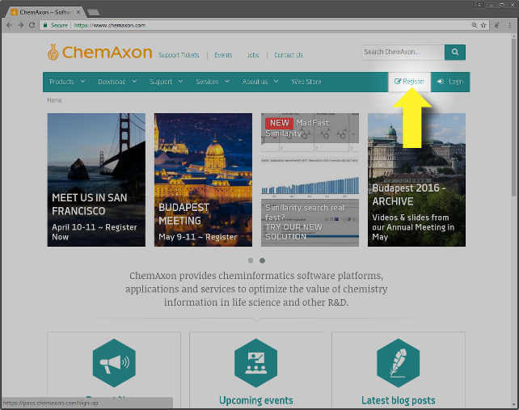
   
 - On the Pass registration form fill your details. The specified email address will be used as the `username` 
   credential during build:
 
   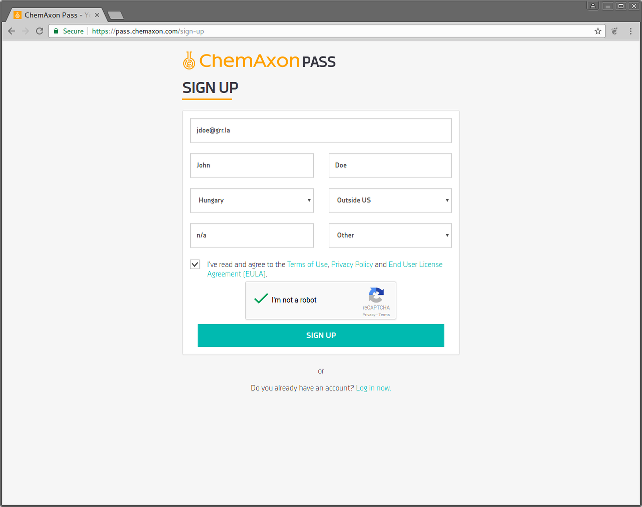
   
 - An activation email is sent to you:
 
   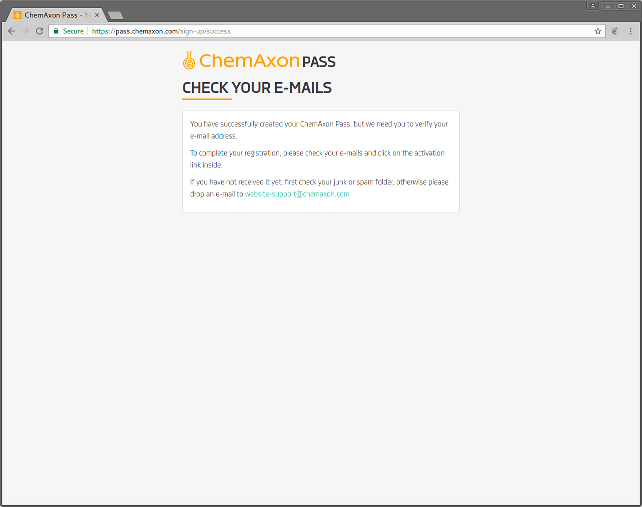
   
 - The activation email contains a link to activate your ChemAxon Pass account. On the activation page you need to 
   specify a password:
   
   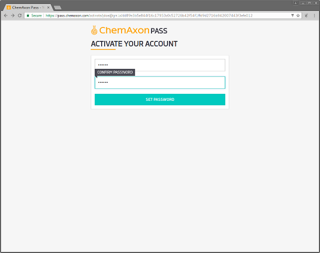
   
 - After the password is specified your ChemAxon Pass account is ready to use:
 
   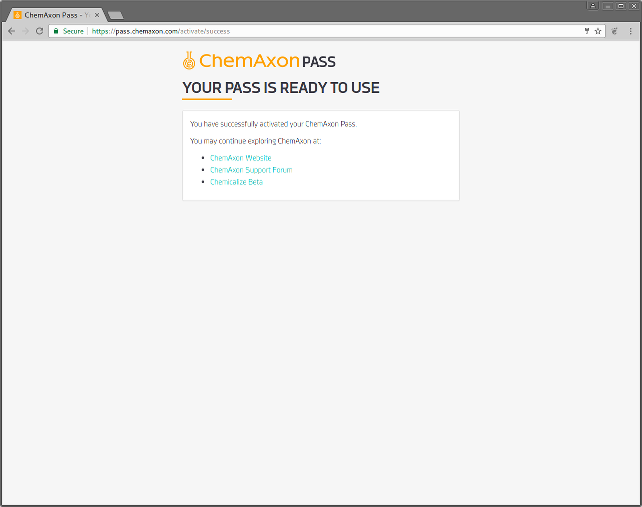


Get an API key for <https://hub.chemaxon.com>
---------------------------------------------

Visit <https://hub.chemaxon.com>, select **Or sign in with: CAS** and sign in with your ChemAxon Pass credentials. After
logging in click on your user name (at the top-right) part of the page and click to generate an API key. You can reveal
the API key which will be required to access the repository.

 - On <https://hub.chemaxon.com> select **Or sign in with: CAS**:
 
   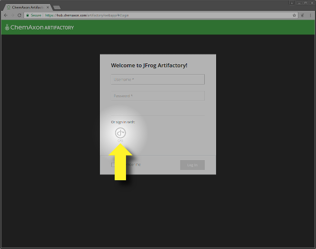
   
 - You are redirected to the CAS login page where you can use your Pass account:
 
   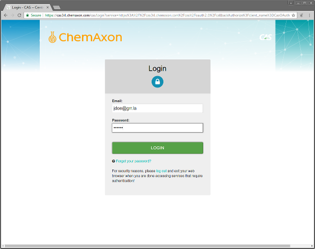
   
 - After a successfull log-in click on your user name at the top-right:
 
   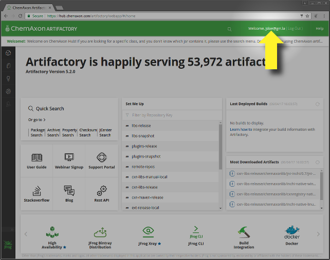
   
 - And generate an API key by clicking on the cogwheel:
 
   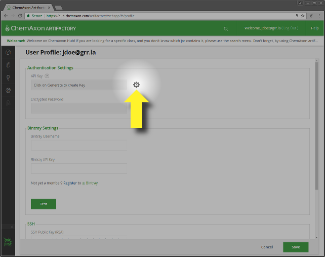
  
 - The API key can be revealed by the eye icon:
 
   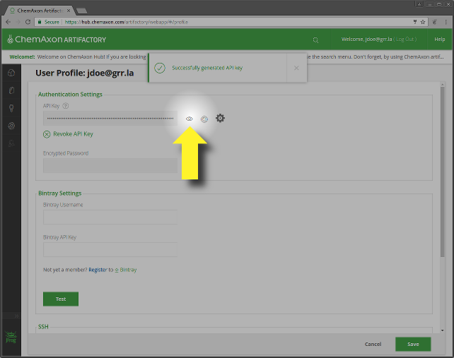
  
 - Copy the API key to use as the `password` credential during build:
 
   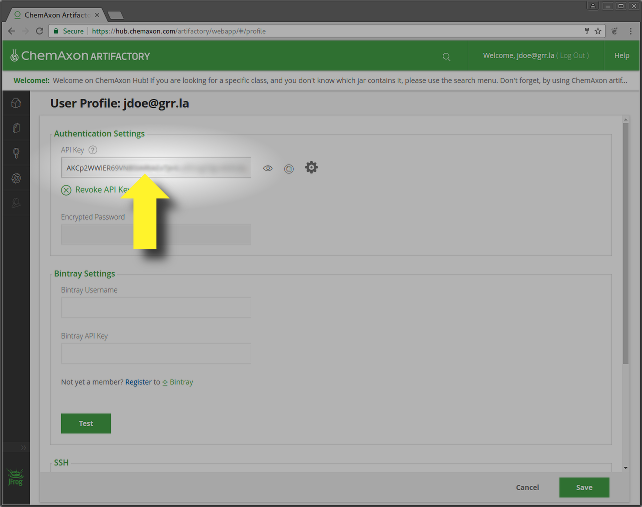


Ensure that your ChemAxon license file is installed
---------------------------------------------------

To request a free evaluation license please contact us at [sales@chemaxon.com](mailto:sales@chemaxon.com).

```` bash
mkdir -p ~/.chemaxon/
cp license.cxl ~/.chemaxon/
````


Clone `jklustor-web-examples`
-----------------------------

```` bash
git clone https://github.com/ChemAxon/jklustor-web-example.git
cd jklustor-web-examples
````


Use the acquired API key for compilation
----------------------------------------

Use your email associated with your Pass account as `cxnHubUser` and the Hub API key acquired as the `cxnHubPass`. For
compilation you will need Java 1.8 installed. Please note that a Vagrant configuration is also provided which sets up
an Ubuntu based box with Java and ChemAxon licenses installed. For details see document 
[Compilation using fresh virtual machine](../vagrant/compile-using-fresh-vm.md).

```` bash
./gradlew -PcxnHubUser=<YOUR PASS EMAIL> -PcxnHubPass=<YOUR HUB API KEY> bootRun
````
